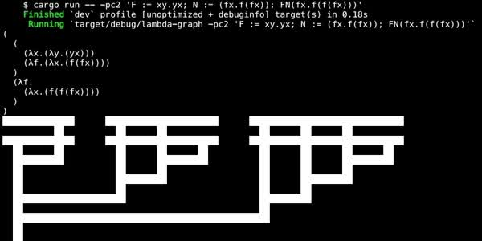

Graph visualization of [John Tromp] style lambda

[John Tromp]: https://tromp.github.io/cl/diagrams.html

# Example

Run `cargo run -- -pc2 'F := xy.yx; N := (fx.f(fx)); FN(fx.f(f(fx)))'`:

# Grammar

- `a` `A` `` `foo` ``: lambda atomic
- `a.b` `λa.b` `^a.b`: lambda function
- `ab`: lambda call

* `abc.a` (curry func) -> `λa.λb.λc.a`
* `abc.abc` (curry call) -> `abc.(ab)c`
* `F := λab.a(ab); F(λab.a)(λab.b)` (name define) -> `(λab.a(ab))(λab.a)(λab.b)`
* `ab.a # comment` (comment) -> `ab.a`
